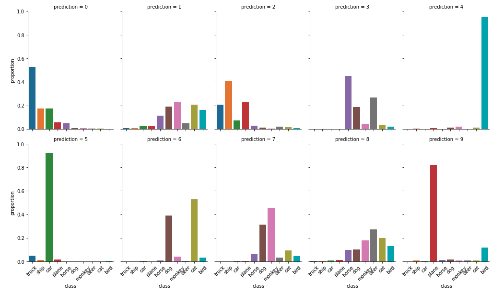
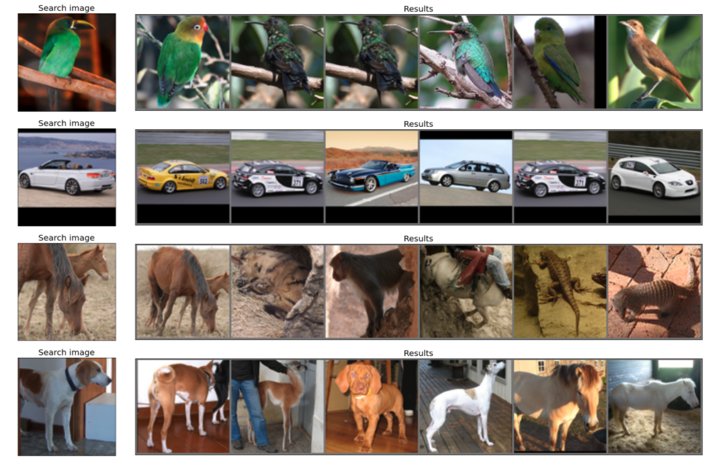

# Barlow Twins Notebooks

After reading the paper [Barlow Twins: Self-Supervised Learning via Redundancy Reduction](https://arxiv.org/abs/2103.03230) which presents an algorithm for training a CNN by optimising the correlation matrix for batches of images, I wanted to look at how these embeddings perform in an unsupervised setting. 
Far each batch, the images are fed into the network twice, with different manipulations. The network has to identify that the two sets of augmented pictures are, in fact, the same batch. The model is optimised for the cross-correlation matrix diagonal to be all 1s.

The pre-trained network (on [ImageNet](https://www.image-net.org/)) is available [here](https://github.com/facebookresearch/barlowtwins) and I use the embeddings it produces in a couple of examples. 

# Notebooks
1. K-Means&BarlowTwins - The aim for this notebook is to see how well we can cluster images using the BarlowTwins image embeddings. I use [CIFAR10](https://www.cs.toronto.edu/~kriz/cifar.html). and [STL10](https://cs.stanford.edu/~acoates/stl10/) (both labelled datasets) to see if the clusters that are identified correspond to the classes that are available in the dataset (10 clusters-10 classes).
TL;DR: The image below says 'yes' for classes (9-plane, 5-car and 4-bird) and 'no' otherwise

2. Annoy&BarlowTwins - In this notebook I use the image embeddings and [Annoy](https://github.com/spotify/annoy) to search through the 100K+ images in [STL10](https://cs.stanford.edu/~acoates/stl10/). Like it promisses, Annoy is realy fast (after you create the index), but the results (from the embeddings) are not extraordinary. 

