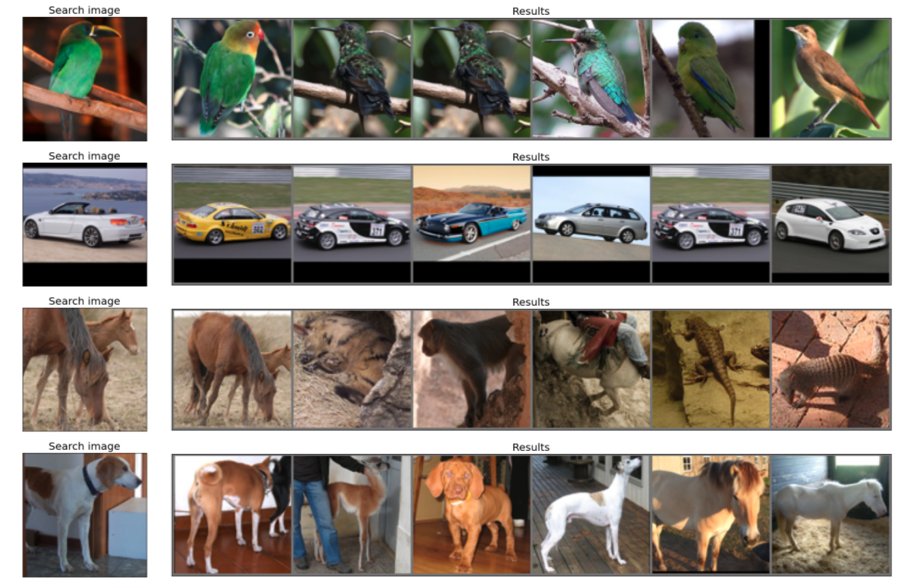

# Notebook repository

In this repository, I store notebooks that I work on. These are mostly POCs and experimentations with algorithms. 

A further `README.md` is added to every folder to explain, in further detail, what it is about. 

# Projects

1. [Barlow Twins: Self-Supervised Learning via Redundancy Reduction](https://arxiv.org/abs/2103.03230) - A self-supervised learning algorithm for images. I use the [pytorch implementation](https://github.com/facebookresearch/barlowtwins) to look at image clustering (with K-means) and image search (with [Annoy](https://github.com/spotify/annoy)).
For the clustering I use [CIFAR10](https://www.cs.toronto.edu/~kriz/cifar.html). and [STL10](https://cs.stanford.edu/~acoates/stl10/) (both labelled datasets) to see if the clusters that are identified correspond to the classes that are available in the dataset (10 clusters-10 classes) and STL10 `train+unlabelled` for the image search.

2. Python - Here I keep some of the notebooks for demonstrating & learning Python itself. 